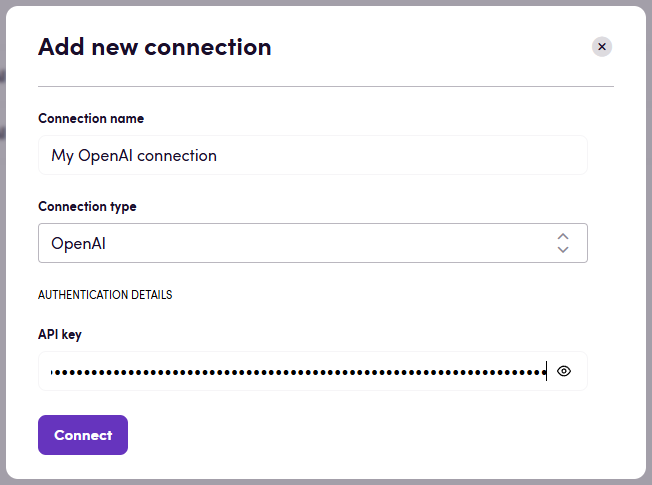
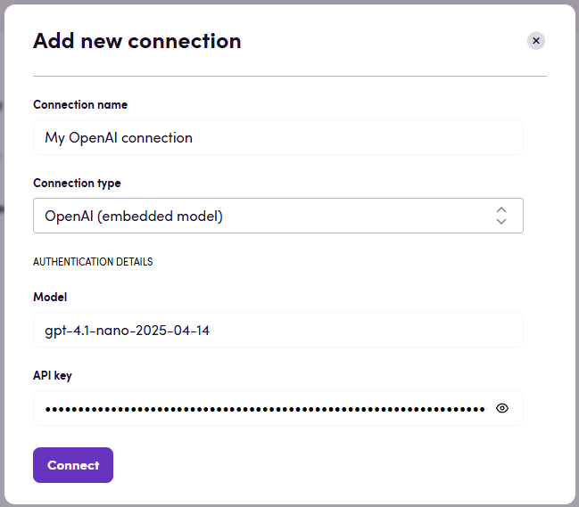
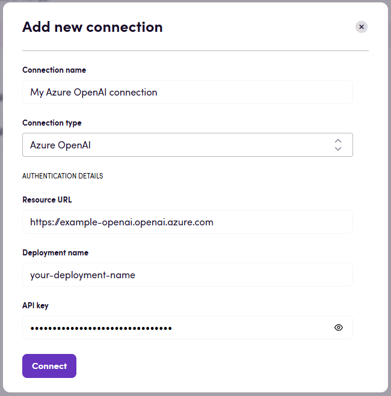
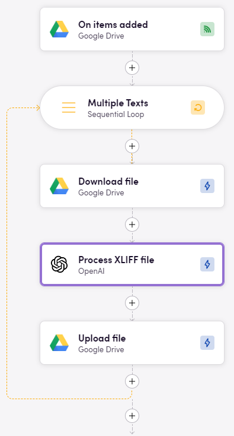
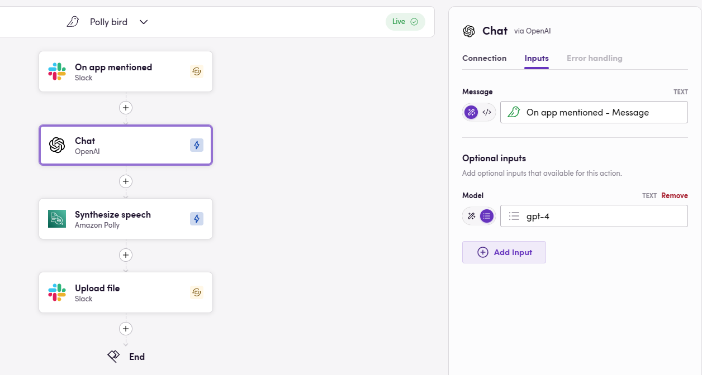

# Blackbird.io OpenAI

Blackbird is the new automation backbone for the language technology industry. Blackbird provides enterprise-scale automation and orchestration with a simple no-code/low-code platform. Blackbird enables ambitious organizations to identify, vet and automate as many processes as possible. Not just localization workflows, but any business and IT process. This repository represents an application that is deployable on Blackbird and usable inside the workflow editor.

## Introduction

<!-- begin docs -->

This OpenAI app in Blackbird gives you access to all OpenAI API endpoints and models, including completions, chat, edits, DALL-E image generation, and Whisper. You can use it with both OpenAI's official API and Azure OpenAI endpoints, supporting all available models, including the latest such as gpt-5, gpt-5-nano, gpt-4.1, and o3.

## Before setting up

Before you can connect you need to make sure that:

### For OpenAI actions

- You have an [OpenAI account](https://platform.openai.com/signup).
- You have generated a new `API key` in the [API keys](https://platform.openai.com/account/api-keys) section, granting programmatic access to OpenAI models on a 'pay-as-you-go' basis. With this, you only pay for your actual usage, which [starts at $0,002 per 1,000 tokens](https://openai.com/pricing) for the fastest chat model. Note that the ChatGPT Plus subscription plan is not applicable for this; it only provides access to the limited web interface at chat.openai.com and doesn't include OpenAI API access. Ensure you copy the entire API key, displayed once upon creation, rather than an abbreviated version. The API key has the shape `sk-xxxxxxxxxxxxxxxxxxxxxxxxxxxxxxxxxxxxxxxxxxxxxxxx`.
- Your API account has a payment method and a positive balance, with a minimum of $5. You can set this up in the [Billing settings](https://platform.openai.com/account/billing/overview) section.

**Note**: Blackbird by default uses the latest models in its actions. If your subscription does not support these models then you have to add the models you can use in every Blackbird action.

### For Azure OpenAI actions

- You have the `Resource URL` for your Azure OpenAI account.
- You know `Deployment name` and `API key` for your Azure OpenAI account.

You can find how to create and deploy an Azure OpenAI Service resource [here](https://learn.microsoft.com/en-us/azure/ai-services/openai/how-to/create-resource?pivots=web-portal).

## Connecting

Navigate to apps and search for OpenAI and click _Add Connection_. This application has three connection types: OpenAI, Azure OpenAI, and OpenAI with an embedded model in the connection. You can select the connection you need from the dropdown menu. Please give your connection a name for future reference, e.g. 'My OpenAI Connection'.

### OpenAI

1. Select `OpenAI` connection type.
2. Fill in your `API key` obtained earlier.
3. Click _Connect_.
4. Verify that connection was added successfully.

If you choose `OpenAI (embedded model)` connection type, please specify the model you want to use.

**Note**: The selected model can be overridden in the action using the `Model` input.

### Azure OpenAI

1. Select `Azure OpenAI` connection type.
2. Enter the `Resource URL`, `Deployment name`, and `API key` for your Azure OpenAI account.
3. Click _Connect_.
4. Verify that connection was added successfully.

**Note**: Pay attention to your `Resource URL` connection parameter. Sometimes the correct URL could have some path after a domain name. For example: https://example.openai.azure.com/**openai**

## Actions

All textual actions have the following optional input values in order to modify the generated response:

- Model (defaults to the latest)
- Maximum tokens
- Temperature
- top_p
- Presence penalty
- Frequency penalty
- Reasoning effort

For more in-depth information about most actions consult the [OpenAI API reference](https://platform.openai.com/docs/api-reference) or [Azure OpenAI API reference](https://learn.microsoft.com/en-us/azure/ai-foundry/openai/latest).

Different actions support various models that are appropriate for the given task (e.g. gpt-4 model for **Chat** action). Action groups and the corresponding models recommended for them are shown in the table below.

| Action group |                                                                                                                          Latest models                                                                                                                           |      Default model (when _Model ID_ input parameter is unspecified)      |                                                                                                                                                                                                                        Deprecated models                                                                                                                                                                                                                         |
| :----------: | :--------------------------------------------------------------------------------------------------------------------------------------------------------------------------------------------------------------------------------------------------------------: | :----------------------------------------------------------------------: | :--------------------------------------------------------------------------------------------------------------------------------------------------------------------------------------------------------------------------------------------------------------------------------------------------------------------------------------------------------------------------------------------------------------------------------------------------------------: |
|     Chat     | gpt-4o, gpt-o1, gpt-o1 mini,  gpt-4-turbo-preview and dated model releases, gpt-4 and dated model releases, gpt-4-vision-preview, gpt-4-32k and dated model releases, gpt-3.5-turbo and dated model releases, gpt-3.5-turbo-16k and dated model releases, fine-tuned versions of gpt-3.5-turbo | gpt-4-turbo-preview; gpt-4-vision-preview for **Chat with image** action |                                                                                                                                                                                    gpt-3.5-turbo-0613, gpt-3.5-turbo-16k-0613, gpt-3.5-turbo-0301, gpt-4-0314, gpt-4-32k-0314                                                                                                                                                                                    |
| Audiovisual  |                                                                      Only whisper-1 is supported for transcriptions and translations. tts-1 and tts-1-hd are supported for speech creation.                                                                      |                  tts-1-hd for **Create speech** action                   |                                                                                                                                                                                                                                -                                                                                                                                                                                                                                 |
|    Images    |                                                                                                                        dall-e-2, dall-e-3                                                                                                                        |                                 dall-e-3                                 |                                                                                                                                                                                                                                -                                                                                                                                                                                                                                 |
|  Embeddings  |                                                                                                                      text-embedding-ada-002                                                                                                                      |                          text-embedding-ada-002                          | text-similarity-ada-001, text-similarity-babbage-001, text-similarity-curie-001, text-similarity-davinci-001, text-search-ada-doc-001, text-search-ada-query-001, text-search-babbage-doc-001, text-search-babbage-query-001, text-search-curie-doc-001, text-search-curie-query-001, text-search-davinci-doc-001, text-search-davinci-query-001, code-search-ada-code-001, code-search-ada-text-001, code-search-babbage-code-001, code-search-babbage-text-001 |

You can refer to the [Models](https://platform.openai.com/docs/models) documentation to find information about available models and the differences between them.

Some actions that are offered are pre-engineered on top of OpenAI. This means that they extend OpenAI's endpoints with additional prompt engineering for common language and content operations.

Do you have a cool use case that we can turn into an action? Let us know!

### Chat

- **Chat** given a chat message, returns a response. You can optionally add a system prompt and/or an image. Also you can add collection of texts and it will be added to the prompt along with the message. Also you can optionally add Glossary as well. Useful if you want to add collection of messages to the prompt. 
- **Chat with system prompt** the same as above except that the system prompt is mandatory.

**Note**: Azure OpenAI does not support audio files for chat actions.

### Translation

- **Translate** translate file content retrieved from a CMS or file storage. The output can be used in compatible Blackbird interoperable actions.
- **Translate in background** similar to the previous action, except that this creates a long running process in the background not blocking your parallel actions. Use in conjunction with a checkpoint to download the result file of this long running background job.
- **Translate text** given a text and a locale, tries to create a localized version of the text.

### Editing

- **Edit** Edit a translation. This action assumes you have previously translated content in Blackbird through any translation action. Only looks at translated segments and will change the segment state to reviewed.
- **Edit in background** similar to the previous action, except that this creates a long running process in the background not blocking your parallel actions. Use in conjunction with a checkpoint to download the result file of this long running background job.
- **Edit Text** given a source segment and translated target segment, responds with an edited version of the target segment taking into account typical mistakes.

### Reporting

- **Create MQM report** Perform an LQA Analysis of a translated XLIFF file. The result will be a text in the MQM framework form.
- **Create MQM report in background** similar to the previous action, except that this creates a long running process in the background not blocking your parallel actions. Use in conjunction with a checkpoint to download the result of this long running background job.

### Review

- **Get translation issues** given a source segment and NMT translated target segment, highlights potential translation issues. Can be used to prepopulate TMS segment comments.
- **Get MQM dimension values** uses the same input and prompt as 'Get MQM report'. However, in this action the scores are returned as individual numbers so that they can be used in decisions. Also returns the proposed translation.

### Background

- **Download background file** use this action to get the output file when doing a translation or edit in the background.
- **Get background result** use this action to get the output text when generating an MQM report in the backgorund.

### Repurposing

- **Summarize** summarizes files and content (Blackbird interoperable) for different target audiences, languages, tone of voices and platforms.
- **Summarize text** summarizes text for different target audiences, languages, tone of voices and platforms.
- **Repurpose** repurpose files and content (Blackbird interoperable) for different target audiences, languages, tone of voices and platforms.
- **Repurpose text** repurpose text for different target audiences, languages, tone of voices and platforms.

> Summarize actions extracts a shorter variant of the original text while repurpose actions do not significantly change the length of the content.

### Glossaries

- **Extract glossary** extracts a glossary (.tbx) from any (multilingual) content. You can use this in well in conjunction with other apps that take glossaries.

### Audio

- **Create transcription** transcribes the supported audiovisual file formats into a textual response.
- **Create English translation** same as above but automatically translated into English.
- **Create speech** generates audio from the text input.

### Images

- **Generate image** use DALL-E to generate an image based on a prompt.
- **Get localizable content from image** retrieves localizable content from given image.

### Text analysis

- **Create embedding** create a vectorized embedding of a text. Useful in combination with vector databases like Pinecone in order to store large sets of data.
- **Tokenize text** turn a text into tokens. Uses Tiktoken under the hood.

### XLIFF operations (To be deprecated, use the corresponding (Edit, Review, Translate, etc.) actions instead)

All XLIFF actions supports 1.2 and 2.1 versions of the XLIFF format, since these are the most common versions used in the industry, but if you need support for other versions, please reach out to us and we will consider adding support for them.

Currently we are using [structured output](https://platform.openai.com/docs/guides/structured-outputs/structured-outputs) feature to return the results of the actions. This means that the output of the actions will be structured in a way that is easy to parse and could increase the stability of the actions. However note, `Structured Outputs` are available in latest large language models, starting with GPT-4o:
- gpt-4o-mini-2024-07-18 and later
- gpt-4o-2024-08-06 and later
 

You can find more information about structured outputs in the [OpenAI documentation](https://platform.openai.com/docs/guides/structured-outputs/introduction).

- **Get Quality Scores for XLIFF file** Gets segment and file level quality scores for XLIFF files. Optionally, you can add Threshold, New Target State and Condition input parameters to the Blackbird action to change the target state value of segments meeting the desired criteria (all three must be filled).

    Optional inputs:
	- Prompt: Add your criteria for scoring each source-target pair. If none are provided, this is replaced by _"accuracy, fluency, consistency, style, grammar and spelling"_.
	- Bucket size: Amount of translation units to process in the same request. (See dedicated section)
	- Source and Target languages: By defualt, we get these values from the XLIFF header. You can provide different values, no specific format required. 
	- Threshold: value between 0-10.
	- Condition: Criteria to filter segments whose target state will be modified.
	- New Target State: value to update target state to for filtered translation units.

    Output:
	- Average Score: aggregated score of all segment level scores.
	- Updated XLIFF file: segment level score added to extradata attribute & updated target state when instructed.

> The Prompt used in this action is "Your input is going to be a group of sentences in `source language` and their translation into `target language`. Only provide as output the ID of the sentence and the score number. The score number is a score from 1 to 10 assessing the quality of the translation, considering the following criteria: `Criteria provided via Prompt input`."

As an example, the settings in the image below will result in all semegments with a score below or equal to 6 to have their target state updated to "needs-review-translation". 

- **Post-edit XLIFF file** Updates the targets of XLIFF files

Optional inputs:
1. Additional instructions: Add your linguistic criteria for postediting targets.
2. Bucket size: Amount of translation units to process in the same request. (See dedicated section)
3. Source and Target languages: By default, we get these values from the XLIFF header. You can provide different values, no specific format required.
4. Glossary: Glossary file in TBX format. The glossary will be used to enhance the target text by incorporating relevant terms from the glossary where applicable.
5. Update locked segments: If true, locked segments will be updated, otherwise they will be skipped. By default, this is set to false.
6. Batch retry attempts: Number of attempts to retry the batch process in case of failure. By default, this is set to 2.
7. Never fail: If true, the action will never fail even with the critical errrors, it will just return the exact same file as input and the error message. By default, this is set to true.

> The Prompt used in this actions is "Your input consists of sentences in `source` language with their translations into `target language`. Review and edit the translated target text as necessary to ensure it is a correct and accurate translation of the source text. If you encounter XML tags in the source also include them in the target text, don't delete or modify them." By using the "Prompt" optional input, your instructions will be appended to the prompt.

Output includes:
1. File: Updated XLIFF file with the post-edited target segments.
2. Usage: Number of tokens used for the action.
3. Error messages: If any errors occurred during the action, they will be included in the output.
4. Error messages count: Number of errors that occurred during the action.
5. Total segments count: Total number of segments (translation units) in the XLIFF file. This number includes all segments, even locked ones.
6. Targets updated count: Number of segments (translation units) that were updated during the action.
7. Proccessed batches count: Number of batches that were processed during the action.

- **Process XLIFF file** given an XLIFF file, processes each translation unit according to provided instructions in the optinal input "Prompt" (if no Prompt is provided, the source texts will be translated) and updates the target text for each unit.

> Whenever a Glossary is added as optional input for any of the above described actions, the Prompt used is "Enhance the target text by incorporating relevant terms from our glossary where applicable. Ensure that the translation aligns with the glossary entries for the respective languages. If a term has variations or synonyms, consider them and choose the most appropriate translation to maintain consistency and precision."

Here is an example bird for processing XLIFF files:

- **Get MQM dimension values from XLIFF** Performs an LQA Analysis of a translated XLIFF file. The result will be in the MQM framework form. This action only returns the scores (between 1 and 10) of each dimension.
- **Get MQM report from XLIFF** Performs an LQA Analysis of the translated XLIFF file. The result will be in the MQM framework form.
- **Get translation issues from XLIFF** Reviews the translated XLIFF file and generate a comment with the issue description

### Bucket size, performance and cost

XLIFF files can contain a lot of segments. Each action takes your segments and sends them to OpenAI for processing. It's possible that the amount of segments is so high that the prompt exceeds to model's context window or that the model takes longer than Blackbird actions are allowed to take. This is why we have introduced the bucket size parameter. You can tweak the bucket size parameter to determine how many segments to send to OpenAI at once. This will allow you to split the workload into different OpenAI calls. The trade-off is that the same context prompt needs to be send along with each request (which increases the tokens used). From experiments we have found that a bucket size of 1500 is sufficient for gpt-4o. That's why 1500 is the default bucket size, however other models may require different bucket sizes.

## Eggs

Check downloadable workflow prototypes featuring this app that you can import to your Nests [here](https://docs.blackbird.io/eggs/tms-to-llm/). 

### Limitations

- The maximum number of translation units in the XLIFF file is `50 000` because a single batch may include up to 50,000 requests

### How to know if the batch process is completed? 

You have 3 options here:

1. You can use the `On background job finished` event trigger to get notified when the batch process is completed. But note, that this is a polling trigger and it will check the status of the batch process based on the interval you set.
2. Use the `Delay` operator to wait for a certain amount of time before checking the status of the batch process. This is a more straightforward way to check the status of the batch process.
3. Since October 2024, users can rely on [Checkpoints](https://docs.blackbird.io/concepts/checkpoints/#large-language-models-llms--batch-processing) to achieve a fully streamlined process. A Checkpoint can pause the workflow until the LLM returns a result or a batch process completes. 

We recommend using the `On background job finished` event trigger as it is more efficient for checking the status of the batch process.

## Events

### Background

- **On background job finished** triggered when an OpenAI batch job reaches a terminal state (completed/failed/cancelled).

## Example

This simple example how OpenAI can be used to communicate with the Blackbird Slack app. Whenever the app is mentioned, the message will be send to Chat to generate an answer. We then use Amazon Polly to turn the textual response into a spoken-word resopnse and return it in the same channel.

## Missing features

In the future we can add actions for:

- Moderation
- Fine-tuning

Let us know if you're interested!

## Actions limitations

- For every action maximum allowed timeout are 600 seconds (10 minutes). If the action takes longer than 600 seconds, it will be terminated. Based on our experience, even complex actions should take less than 10 minutes. But if you have a use case that requires more time, let us know.

> OpenAI is sometimes prone to errors. If your Flight fails at an OpenAI step, please check https://status.openai.com/history first to see if there is a known incident or error communicated by OpenAI. If there are no known errors or incidents, please feel free to report it to Blackbird Support.

## Feedback

Feedback to our implementation of OpenAI is always very welcome. Reach out to us using the [established channels](https://www.blackbird.io/) or create an issue.

<!-- end docs -->
